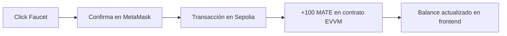

# 🪙 Guía de Tokens MATE - EVVM Cross-Chain Balancer

## ⚠️ **Importante: Los tokens MATE NO aparecen en Etherscan**

### **¿Qué son los tokens MATE?**

Los tokens MATE son **balances internos** dentro de los contratos EVVM, **NO son tokens ERC20** estándar. Por esto:

- ❌ **NO aparecen en Etherscan** en tu wallet
- ❌ **NO aparecen en MetaMask** como tokens
- ✅ **SÍ aparecen en el frontend** de la aplicación
- ✅ **SÍ se pueden transferir** entre EVVM-A y EVVM-B

### **¿Cómo verificar tus balances MATE?**

#### **1. En el Frontend (Recomendado)**
- Conecta tu wallet a Ethereum Sepolia
- Los balances aparecen automáticamente en las tarjetas EVVM-A y EVVM-B
- Usa los botones "🔄 Refresh" para actualizar

#### **2. Usando Cast (Terminal)**
```bash
# Balance en EVVM-A
cast call 0xcdFde01B0A41914B076D8aF8f50c4eCbe8E3E639 "getBalance(address,address)" TU_ADDRESS 0x0000000000000000000000000000000000000001 --rpc-url https://ethereum-sepolia-rpc.publicnode.com

# Balance en EVVM-B
cast call 0x4B2CB8a51C8522f18234Aa7b441725106248B432 "getBalance(address,address)" TU_ADDRESS 0x0000000000000000000000000000000000000001 --rpc-url https://ethereum-sepolia-rpc.publicnode.com
```

#### **3. En la Consola del Navegador**
1. Abre Developer Tools (F12)
2. Ve a la pestaña Console
3. Busca logs como:
   ```
   ✅ Balance A (formatted): 1000.0000 MATE
   ✅ Balance B (formatted): 1000.0000 MATE
   ```

### **¿Cómo usar el Faucet?**

#### **Pasos para obtener tokens MATE:**

1. **Conectar Wallet**: Conecta MetaMask a Ethereum Sepolia
2. **Usar Faucet**: Haz click en "🚰 Get 100 MATE" en EVVM-A o EVVM-B
3. **Confirmar Transacción**: Confirma la transacción en MetaMask
4. **Verificar Balance**: Los balances se actualizan automáticamente

#### **Lo que sucede cuando usas el faucet:**



### **¿Por qué no aparece en Etherscan?**

**Los tokens MATE son una implementación custom:**

```solidity
// En el contrato MockEVVM
mapping(address => mapping(address => uint256)) private balances;

function getBalance(address user, address token) external view returns (uint256) {
    return balances[user][token];
}

function addBalance(address user, address token, uint256 amount) external {
    balances[user][token] += amount;
}
```

- Son **mappings internos** en el contrato
- NO siguen el estándar ERC20
- NO emiten eventos Transfer estándar
- NO aparecen en exploradores como tokens normales

### **Verificación de Transacciones**

#### **Lo que SÍ puedes ver en Etherscan:**

✅ **Transacciones de faucet**: Las llamadas a `addBalance()`
- Ve a: https://sepolia.etherscan.io/address/TU_ADDRESS
- Busca transacciones a los contratos EVVM
- Verás las llamadas a funciones pero no los tokens

✅ **Transacciones de transfer**: Las llamadas al balancer
- Ve a: https://sepolia.etherscan.io/address/0x20492001407c5C2a64D9Aa1c5bA00A2825B75044
- Verás las transacciones de transferencias directas

### **Contratos Desplegados**

```javascript
// Ethereum Sepolia
EVVM_A: '0xcdFde01B0A41914B076D8aF8f50c4eCbe8E3E639'
EVVM_B: '0x4B2CB8a51C8522f18234Aa7b441725106248B432'
BALANCER: '0x20492001407c5C2a64D9Aa1c5bA00A2825B75044'
PRINCIPAL_TOKEN: '0x0000000000000000000000000000000000000001'
```

### **🎯 Resumen para el Usuario**

1. **Los tokens MATE son balances internos**, no tokens ERC20
2. **Usa el frontend** para ver y gestionar tus balances
3. **El faucet funciona** - añade 100 MATE por transacción
4. **Las transferencias funcionan** - mueve MATE entre EVVM-A y EVVM-B
5. **NO busques en Etherscan** - usa el frontend o cast calls

**¡El sistema funciona perfectamente - solo es diferente a los tokens ERC20 normales!** 🚀